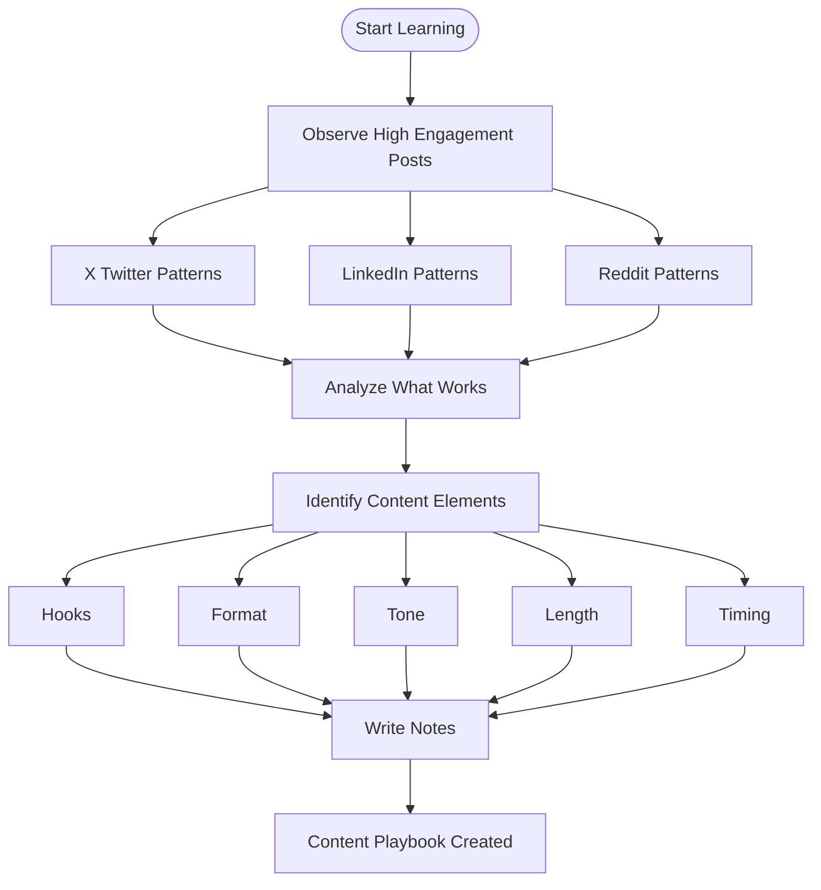

```mermaid
flowchart TD
    A([Start Learning]) --> B[Observe High Engagement Posts]

    B --> C1[X Twitter Patterns]
    B --> C2[LinkedIn Patterns]
    B --> C3[Reddit Patterns]

    C1 --> D[Analyze What Works]
    C2 --> D
    C3 --> D

    D --> E[Identify Content Elements]

    E --> E1[Hooks]
    E --> E2[Format]
    E --> E3[Tone]
    E --> E4[Length]
    E --> E5[Timing]

    E1 --> F[Write Notes]
    E2 --> F
    E3 --> F
    E4 --> F
    E5 --> F

    F --> G[Content Playbook Created]

```