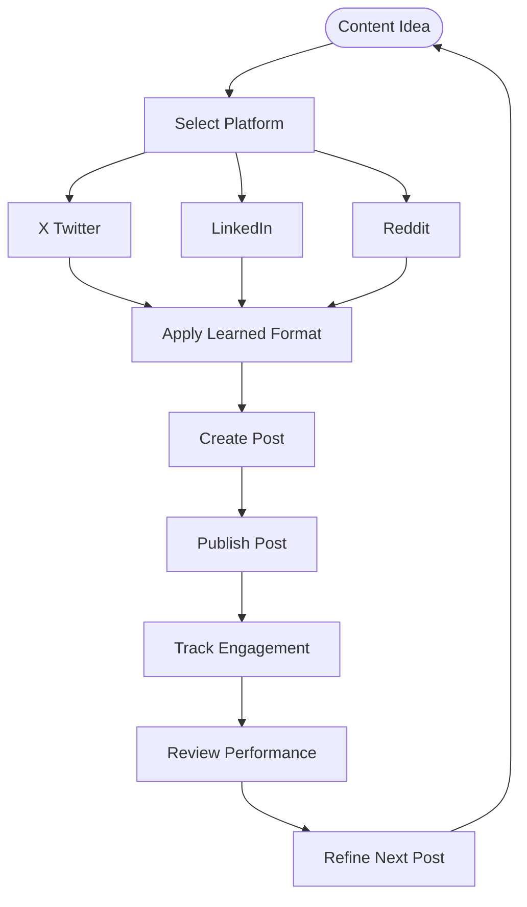

```mermaid
flowchart TD
    A([Content Idea]) --> B[Select Platform]

    B --> C1[X Twitter]
    B --> C2[LinkedIn]
    B --> C3[Reddit]

    C1 --> D[Apply Learned Format]
    C2 --> D
    C3 --> D

    D --> E[Create Post]

    E --> F[Publish Post]

    F --> G[Track Engagement]

    G --> H[Review Performance]

    H --> I[Refine Next Post]

    I --> A


```